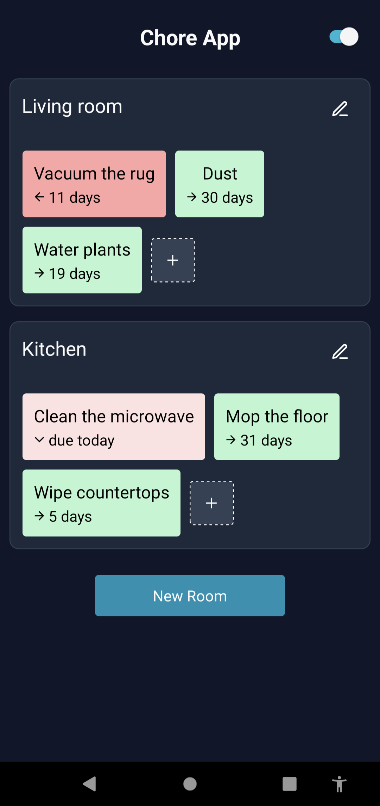
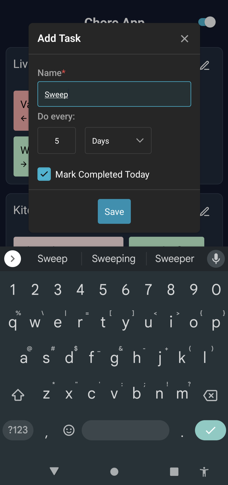

# Sarah's Simple Chore App

A single-page React Native application to keep track of what chores need to be done. The app is organized by rooms, where each room has a list of chores. Chores are set to repeat after configurable periods of time, and users can log when they last completed the chore. Each chore will then say when it needs to be done again.

## About

A chore app to help track recurring chores on a room-by-room basis (for example, you might want to sweep in the living room once a week). The app will keep track of when a chore was last completed, and tell you when you'll need to do it again.

## Technologies

This app uses React Native, Redux, NativeBase, and Expo.

## Project Status

This app is currently in development, but the core features are present. Users are able to add, edit, and remove rooms and chores. Chore repetition times and due dates are fully implemented.

**future features:**

- Reminder notifications
- Drag-and-drop to reorder rooms
- Drag-and-drop to reorder tasks
- Ability to sort tasks by completion date or most overdue
- Task importance levels

## Installation

**Disclaimer:** I have only tested this app on my Android device. Use iOS at your own peril.

**Dependencies**

- [npm](https://www.npmjs.com/)
- [expo](https://docs.expo.dev/get-started/installation/)
- [expo app](https://play.google.com/store/apps/details?id=host.exp.exponent&hl=en_US&gl=US&pli=1) (for mobile)

### Installation:

`npm install`

### Start server:

`expo start`
